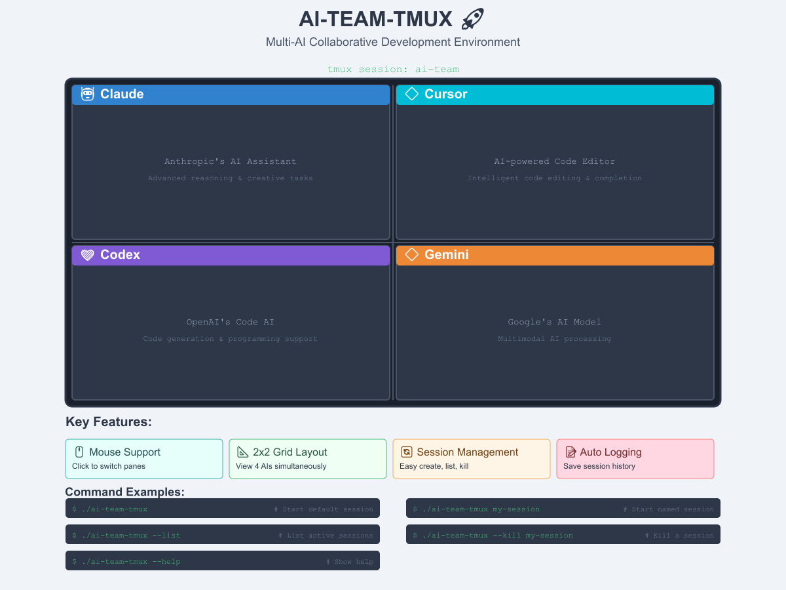

# AI-TEAM-TMUX 🚀

[](https://opensource.org/licenses/MIT)
[](https://github.com/tmux/tmux)

Multi-AI Collaborative Development Environment - Use Claude, Cursor, Codex, and Gemini simultaneously in a unified tmux interface.

[English](#english) | [日本語](README_JP.md)

## 🌟 Overview

AI-TEAM-TMUX brings together multiple AI assistants in a single tmux workspace. Perfect for developers who want to leverage different AI strengths simultaneously.



## ✨ Features

- 📐 **Quad layout** - 2x2 grid with 4 AIs
- 🖱️ **Mouse support** - Click to switch between panes
- 🔄 **Easy session management** - Create, list, and kill sessions

## 🚀 Quick Start

### Prerequisites

- tmux 3.0 or higher
- AI CLI tools installed:
  - `claude` - Claude AI CLI
  - `cursor-agent` - Cursor AI CLI
  - `codex` - Codex AI CLI
  - `gemini` - Gemini AI CLI
- Bash 4.0+

### Installation

```bash
# Clone the repository
git clone https://github.com/cruzyjapan/AI-Team-Tmux.git
cd AI-Team-Tmux

# Run initial setup (recommended)
./init.sh setup

# Or manually make executable
chmod +x ai-team-tmux

# Start with default layout
./ai-team-tmux
```

### Quad Layout (2x2 Grid)
All 4 AIs in a 2x2 grid:
```
┌─────────────┬─────────────┐
│ 0: Claude   │ 2: Cursor                             │
├─────────────┼─────────────┤
│ 1: Codex    │ 3: Gemini                             │
└─────────────┴─────────────┘
```

## 🎨 Visual Identification

Each AI pane displays a unique emoji for easy identification:

- **Claude**: 🤖
- **Cursor**: 🖱️  
- **Codex**: 🔧
- **Gemini**: ✨

## 🎯 Usage

### Basic Commands

```bash
# Start default session
./ai-team-tmux

# Start named session
./ai-team-tmux my-session

# List active sessions
./ai-team-tmux --list

# Kill a session
./ai-team-tmux --kill my-session

# Show help
./ai-team-tmux --help
```
## 🔧 Configuration

Sessions and logs are stored in:
```
~/.config/ai-team-tmux/     # Configuration
~/.local/share/ai-team-tmux/
├── logs/                   # Session logs  
└── recordings/             # Session recordings
```

### Setup and Maintenance Script

Use `init.sh` for setup and log management:

```bash
# Initial setup - creates directories and config
./init.sh setup

# Check system status
./init.sh status

# Clean old logs (older than 7 days)
./init.sh clean-logs

# Clean old logs (custom retention)
./init.sh clean-logs 30  # Remove logs older than 30 days

# Remove all logs
./init.sh clean-all-logs

# Show help
./init.sh help
```

### Configuration File

The configuration file (`~/.config/ai-team-tmux/config.conf`) allows you to:
- Enable/disable logging
- Enable/disable session recording
- Set log retention days
- Customize AI command paths

## 🐛 Troubleshooting

### AI Tool Not Found
Ensure AI CLIs are installed and in PATH:
```bash
which claude
which cursor-agent
which codex
which gemini
```

### Session Already Exists
```bash
./ai-team-tmux --kill session-name
./ai-team-tmux session-name
```

### tmux Not Found
```bash
# Ubuntu/Debian
sudo apt-get install tmux

# macOS
brew install tmux
```

## 📝 License

MIT License - see the [LICENSE](LICENSE) file for details.

## 🙏 Acknowledgments

- Claude by Anthropic
- Cursor by Anysphere
- Codex by OpenAI
- Gemini by Google

---

**Made with ❤️ for the AI-assisted development community**